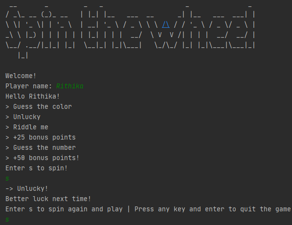
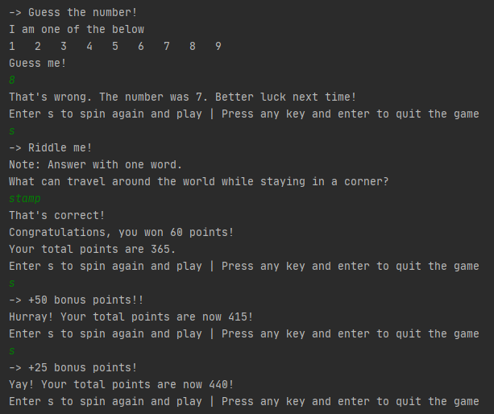
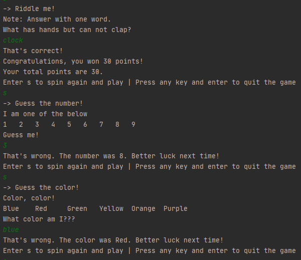

# Spin The Wheel
<table>
  <tr>
    <td></td>
    <td>
      <b>Spin the wheel :ferris_wheel: </b> is a simple arcade style game built with Kotlin for the <b><a href="https://twitter.com/hashtag/30daysofkotlin?lang=en">#30DaysOfKotlin</a></b> 
      initiative by <i><a href="https://eventsonair.withgoogle.com/events/kotlin">Google Developers</a></i>.  
      It is played on the output window and has the following games:
      <ul>
        <li>Guess the color :rainbow:</li>
        <li>Riddle me :interrobang:</li>
        <li>Guess the number :slot_machine:</li>
      </ul>
      It also has some fun sections like unlucky, +25 and +50 bonus points.
    </td>
  </tr>
</table>  

## Implemented Kotlin Concepts 🛠
The following concepts were implemented after learning from the <a href="https://developer.android.com/courses/kotlin-bootcamp/overview">
Kotlin Bootcamp for Programmers</a> Codelabs. The concepts are also highlighted as comments in the 
<a href="https://github.com/rithika-hebbar/SpinTheWheel/blob/master/src/spinthewheel.kt">source code</a>.
<ul>
  <li>Data Class</li>
  <li>Compact Functions</li>
  <li>Lambda Function</li>
  <li>Higher-Order Function</li>
  <li>Nullable Types</li>
  <li>Default Argument</li>
  <li>Named Parameters</li>
  <li>Java Interoperability</li>
  <li>Random() Function</li>
</ul>

## Game Play Images :computer:
<table>
  <tr>
    <td></td>
    <td></td>
  </tr>
 </table>
